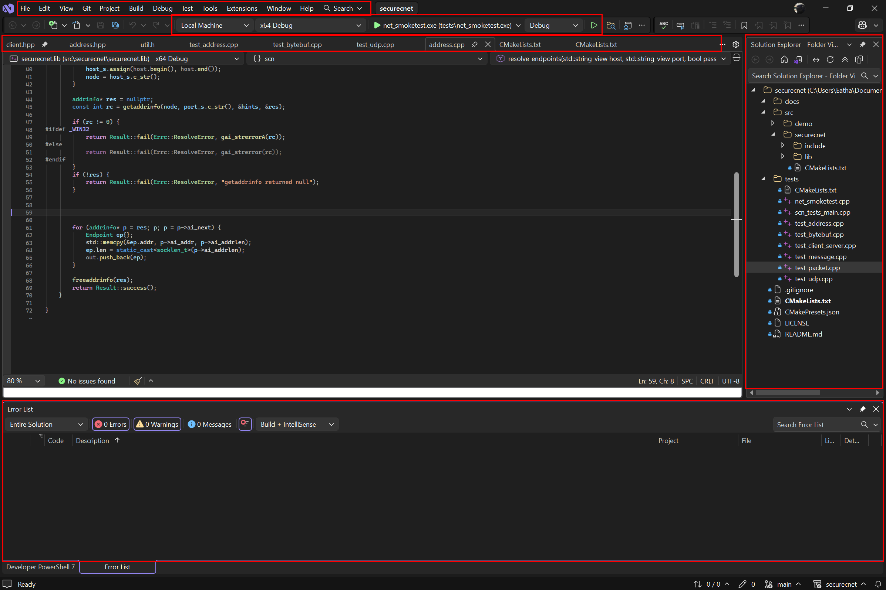
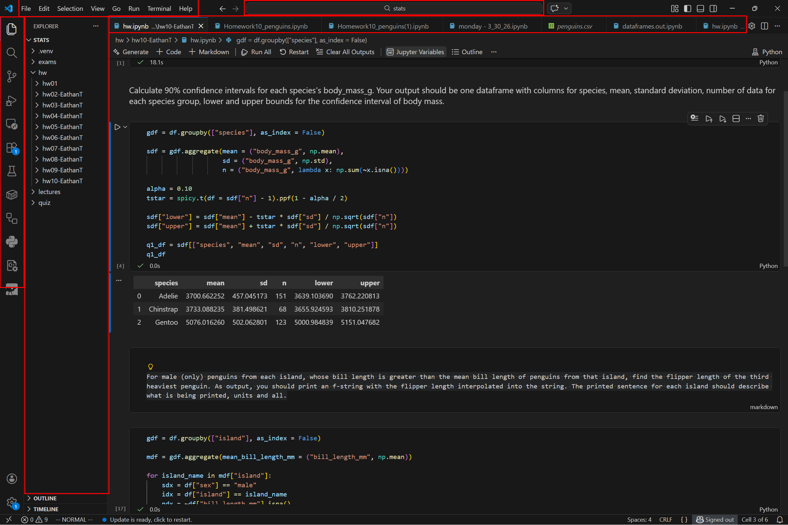
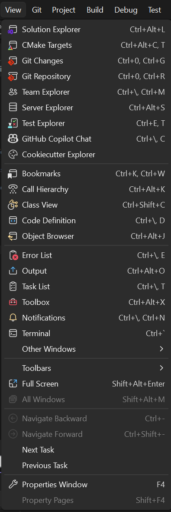

# Software Development is hard

I use Visual Studio 2026 for most of my heavier programming projects, especially when I am working in C/C++ or dealing with larger solutions that have a lot of files, dependencies, and build settings. For smaller assignments or quick edits, I usually use VS Code because it opens faster and feels less overwhelming. Because of that, I have gotten used to the simpler workflow in VS Code, where I can usually open a folder, edit a file, and move on without thinking too hard about the environment itself.

One thing I have noticed while using Visual Studio 2026 is that it feels much more powerful than VS Code, but also much more demanding. That became obvious to me during a recent project when I was trying to track down a bug in a C++ application. My goal was simple: run the program, step through the code, and figure out why one part of the program was not behaving the way I expected.

This is where Visual Studio showed both its strengths and its weaknesses. On the positive side, the debugger is still one of the best parts of the program. I could set breakpoints, inspect variables, and move through the code in a way that felt much more complete than what I usually get in VS Code. That part of the experience matched what I expect from a full IDE. It made the project feel manageable, even though the code itself was not.

At the same time, actually getting to that point felt more complicated than it should have been. There were multiple panels open, several project options on screen, and a lot of interface elements competing for attention. Some of that information is useful, but not all of it feels equally important in the moment. I found myself spending extra time just figuring out where to look, which added friction to what should have been a straightforward debugging task.

This connects to the idea of cognitive load, which refers to how much mental effort a system requires from the user. Visual Studio 2026 often has high cognitive load because it puts so many tools, menus, and windows in front of the user at once. That can be helpful for experienced developers who need those features, but it can also make the environment feel cluttered and tiring, especially when I am just trying to focus on one bug.

It also made me think about mental model, or the way a user expects a system to work based on past experience. Because I use VS Code regularly, I have developed a mental model that coding environments should feel lightweight and direct. I expect to open a project and get into the code quickly. Visual Studio does not really work that way. Its design assumes that the user may want access to a full set of professional tools at all times. That mismatch is not exactly a flaw, but it does create frustration when my expectations do not match the way the software is organized. The Views tab is a great example of the various tools you have in your disposal in Visual Studio 2026, and you can get an idea that is appliaction is meant for more professional needs. 

Another relevant concept is feedback, which is how the system communicates what is happening. Visual Studio usually gives good technical feedback once I am actively debugging, since it clearly shows variable values, call stacks, and breakpoints. However, the interface is less effective at showing which information matters most at any given moment. There is a lot on screen, but not all of it helps equally. In that sense, the software gives plenty of information, but not always the clearest guidance.

Compared to VS Code, Visual Studio 2026 feels less flexible and more exhausting to use casually. VS Code gets out of the way better. It feels cleaner and faster for small tasks. Visual Studio, on the other hand, feels like a giant toolbox that I drag out when the work becomes more complicated. That is useful, but it also means I notice the size and weight of the software more often.

Overall, my experience with Visual Studio 2026 is mixed. I like it because it is capable and genuinely useful when I need strong debugging tools or when I am working on a larger project. I do not like how crowded and heavy it can feel, especially compared to VS Code. I think the biggest improvement would be to make the interface do a better job of emphasizing only the most relevant tools for the task in front of the user. That would lower the cognitive load without removing the advanced features that make Visual Studio valuable in the first place.
